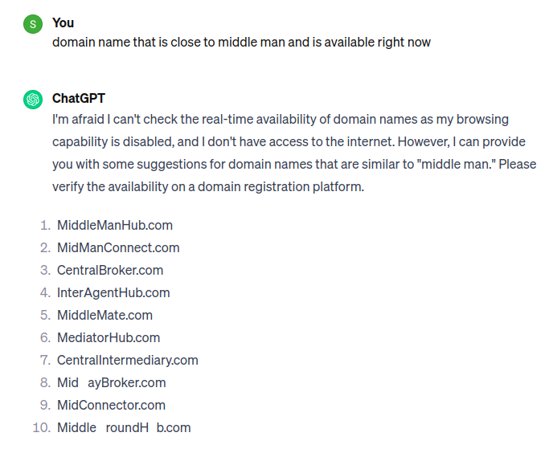

# Inspiration

As shown above we can get a bunch of suggestions from many sources like chatgpt in above example.
But checking if they are available one by one in whois.net is not something we would enjoy.

This application is made to check them all at once.

In the mean time we can only see the availability of the domains.


# Setup

```
git clone git@github.com:Sagar535/domain-finder.git
cd domain-finder
yarn
```

The application uses the api `https://api-ninjas.com/api/whois`, check documentation there to understand the api better. We need an X-Api-Key so create account and get yours.

Once you get it create a file .env.local in root directory and paste it as


```
NEXT_PUBLIC_API_NINJA_TOKEN=**************************************
```

Run your application:

```
yarn dev
```

Now you can paste bunch of domains, click submit and check if the domains are available or not.
